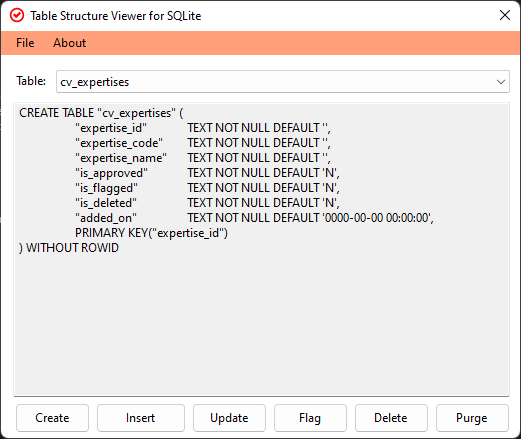

# pragma.sqlite

Table structure viewer for SQLite

* Connects to the user-selected .db file.
* Looks up for list of tables.
* Fetches table structures when you choose a table.
* Basic hints on other SQL operations

## How to?

* Clone the repo.
* Open src/pragma.sqlite.sln
* Restore nuget packages using C#/Visual Studio.
* Compile it, and run.
* File > Open > Choose a .db sqlite file to proceed.
* Choose different tables to load the structure.

It is a generic experimental product.

## Libraries used:

* [Microsoft.Data.Sqlite]()
* [SQLitePCLRaw]()
