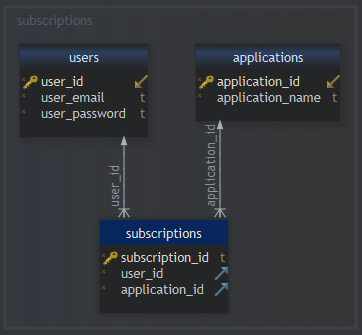
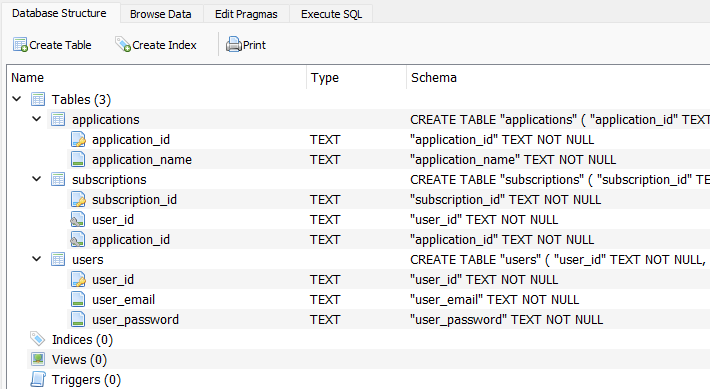
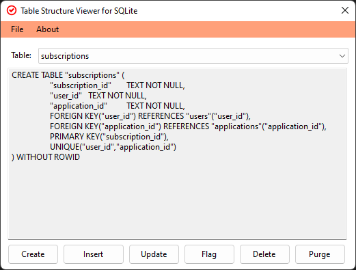

# Sample Database

Understanding sample database provided as: [application/application.db](https://github.com/anytizer/pragma.sqlite/raw/main/sample/application/application.db) (download).

More complex database: [icons/icons.db](https://github.com/anytizer/pragma.sqlite/raw/main/sample/icons/icons.db) (download).

## Schema

Diagram made with [DBSchema](https://dbschema.com/)

## Full list of tables

Database made with [DB Browser for SQLite](https://sqlitebrowser.org/)

**Note:** DB Browser for SQLite is a high quality, visual, open source tool to create, design, and edit database files compatible with SQLite.

## pragma.sqlite

Screenshot as appears with this software - displaying create view only.
